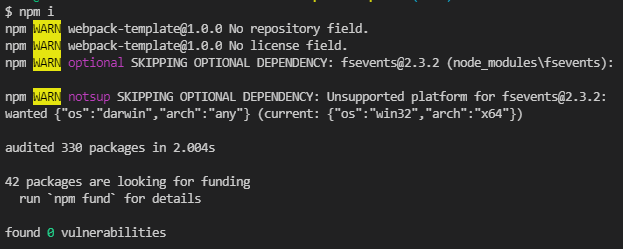
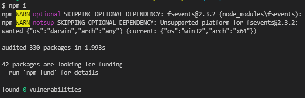
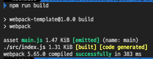

# Webpack 5 Full Project Setup

- [youtube- Webpack 5 Full Project Setup](https://youtu.be/TOb1c39m64A)

## 초기설정

### package.json 생성

```bash
# package.json 생성
npm init -y
```

###### package.json

```json
{
  "private": true,
  "scripts": {
    "test": "echo \"Error: no test specified\" && exit 1"
  }
}
```

- 불필요한 것들 제거하고 script만 있으면 된다.
- `"private": true`: 패키지 비공개 여부

###### `private`이 없을 때, `npm i`



###### `private`이 있을 때, `npm i`



warnning이 없어진걸 확인할 수 있다.

### webpack install

- webpack, webpack-cli, webpack-dev-server, html-webpack-plugin 설치

```bash
npm i -D webpack webpack-cli webpack-dev-server
```

###### package.json

```json
{
  "private": true,
  "scripts": {
    "start": "webpack serve",
    "watch": "webpack --watch",
    "build": "webpack"
  },
  "devDependencies": {
    "webpack": "^5.65.0",
    "webpack-cli": "^4.9.1",
    "webpack-dev-server": "^4.6.0"
  }
}
```

###### `npm run build`


### webpack.config 파일 생성

###### webpack.config.js

```js
module.exports = {
  mode: 'development',
  devtool: false,
  devServer: {
    static: './dist',
  },
};
```

`devtool`옵션은 개발의 편의성을 위해 제공되는 소스맵(Source Map) 옵션이다.

## babel

```bash
npm i -D babel-loader @babel/core @babel/preset-env
```

### babel config 설정

###### webpack.config.js 수정

```js
module.exports = {
  // ...
  module: {
    rules: [
      {
        test: /\.js$/,
        exclude: /node_modules/,
        use: {
          loader: 'babel-loader',
        },
      },
    ],
  },
  // ...
};
```

###### babel.config.js 생성

```js
module.exports = {
  presets: ['@babel/preset-env'],
};
```



### Source Maps, 개발용과 배포용 분기

###### webpack.config.js

```js
let mode = 'development';
if (process.env.NODE_ENV === 'production') {
  mode = 'production';
}
module.exports = {
  mode: mode,
  // ...
  devtool: 'source-map',
  // ...
};
```

###### package.json

```json
// ...
  "scripts": {
    // ...
    "build": "NODE_ENV=production webpack",
    "build-dev": "webpack"
  },
// ...
```

## CSS, SASS, PostCSS, HMR

```bash
npm i -D css-loader mini-css-extract-plugin
```

###### webpack.config.js

```js
const MiniCssExtractPlugin = require('mini-css-extract-plugin');
module.exports = {
  // ...
  module: {
    rules: [
      {
        test: /\.css$/i,
        use: [MiniCssExtractPlugin.loader, 'css-loader'],
      },
    ],
  },
  plugins: [new MiniCssExtractPlugin()],
  // ...
};
```
