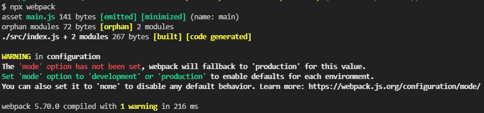

# Creating and Understanding a Basic Webpack 5 Setup

- [youtube - Creating and Understanding a Basic Webpack 5 Setup](https://youtu.be/X1nxTjVDYdQ)

###### package.json 생성

```bash
# package.json 생성
npm init -y
```

### 폴더 directory

```
- src
  - index.js
```

## JavaScript bundle을 위한 Webpack 소개와 예시

###### webpack install

- `webpack`, `webpack-cli` 설치

```bash
npm i -D webpack webpack-cli
```

###### 빌드 확인

```bash
npx webpack
```



빌드 완료 후, `dist` 폴더가 생성된 걸 확인할 수 있다. \
`dist` 폴더 안에는 `index.js`가 변환된 `main.js`파일이 생성된다.

`dist` 폴더 안에 임시로 아래 내용의 `index.html`을 생성하고, console을 확인해보자

###### dist/index.html 생성

```html
<!DOCTYPE html>
<html lang="ko">
  <head>
    <meta charset="UTF-8" />
    <meta http-equiv="X-UA-Compatible" content="IE=edge" />
    <meta name="viewport" content="width=device-width, initial-scale=1.0" />
    <title>Creating and Understanding a Basic Webpack 5 Setup</title>
  </head>
  <body>
    <script src="./index.js"></script>
  </body>
</html>
```

###### src/getClasses.js 생성

```js
import { wizard } from './wizard';
import { barbarian } from './barbarian';

function getClasses() {
  console.log('get classes was called');
  console.log(wizard);
  console.log(barbarian);
}

export default getClasses;
```

###### src/index.js 수정

```js
import getClasses from './getClasses';

console.log('Creating and Understanding a Basic Webpack 5 Setup');

getClasses();
```

###### package.json 수정

```json
{
  // ...
  "scripts": {
    "build": "webpack"
  }
  // ...
}
```

`"build": "webpack"`을 추가하여 webpack의 로컬 버전을 실행한다. \
`npm run build`로 `npx webpack`을 대체할 수 있다.

## Webpack을 통해 Babel 변환

es6와 같은 최신(?) javascript 코드를 오래된 브라우저에서도 동일하게 작동하기 위해 변환이 필요하다.

###### babel install

```bash
npm i -D babel-loader @babel/core @babel/preset-env
```

###### webpack.config.js 생성

```js
module.exports = {
  mode: 'development',
  module: {
    rules: [
      {
        test: /\.js$/,
        exclude: /node_modules/,
        use: {
          // 추가 설정을 사용하지 않으면, .babelrc가 참조됩니다.
          loader: 'babel-loader',
        },
      },
    ],
  },
};
```

<!--
## 개발 모드와 생산 모드 전환
## 디버깅용 소스 맵
## 저장 시 재구축 감시 모드
## 저장 시 핫 새로고침용 개발 서버
## 커스텀 입력 및 출력 경로
## 개발 또는 운영 환경을 동적으로 설정
## babel-preset-env에서 아직 찾을 수 없는 것
## 정리 -->
