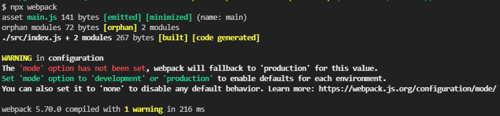

# Creating and Understanding a Basic Webpack 5 Setup

- [youtube - Creating and Understanding a Basic Webpack 5 Setup](https://youtu.be/X1nxTjVDYdQ)

## 프로젝트 설정

### 프로젝트 시작

###### package.json 생성

```bash
npm init -y
```

<br />

### 폴더 directory

```
- src
  - index.js
- dist
  - index.html
- package.json
- .babelrc
- webpack.config.js
```

_NOTE: 일반적으로 dist 또는 public 폴더는 git에서 업로드하지 않지만, 데모 목적으로 업로드됐다._

<br />

### JavaScript bundle을 위한 Webpack 소개와 예시

###### webpack install

```bash
npm i -D webpack webpack-cli
```

###### 빌드 확인

```bash
npx webpack
```



빌드 완료 후, `dist` 폴더가 생성된 걸 확인할 수 있다. \
`dist` 폴더 안에는 `index.js`가 변환된 `main.js`파일이 생성된다.

`dist` 폴더 안에 임시로 아래 내용의 `index.html`을 생성하고, console을 확인해보자

###### dist/index.html 생성

```html
<!DOCTYPE html>
<html lang="ko">
  <head>
    <meta charset="UTF-8" />
    <meta http-equiv="X-UA-Compatible" content="IE=edge" />
    <meta name="viewport" content="width=device-width, initial-scale=1.0" />
    <title>Creating and Understanding a Basic Webpack 5 Setup</title>
  </head>
  <body>
    <script src="./index.js"></script>
  </body>
</html>
```

###### src/getClasses.js 생성

```js
import { wizard } from './wizard';
import { barbarian } from './barbarian';

function getClasses() {
  console.log('get classes was called');
  console.log(wizard);
  console.log(barbarian);
}

export default getClasses;
```

###### src/index.js 수정

```js
import getClasses from './getClasses';

console.log('Creating and Understanding a Basic Webpack 5 Setup');

getClasses();
```

###### package.json 수정

```json
{
  // ...
  "scripts": {
    "build": "webpack"
  }
  // ...
}
```

`"build": "webpack"`을 추가하여 webpack의 로컬 버전을 실행한다. \
`npm run build`로 `npx webpack`을 대체할 수 있다.

<br />

### Webpack을 통해 Babel 변환

es6와 같은 최신(?) javascript 코드를 오래된 브라우저에서도 동일하게 작동하기 위해 변환이 필요하다.

###### babel install

```bash
npm i -D babel-loader @babel/core @babel/preset-env
```

###### webpack.config.js 생성

```js
module.exports = {
  module: {
    rules: [
      {
        test: /\.js$/,
        exclude: /node_modules/,
        use: {
          // 추가 설정을 사용하지 않으면, .babelrc가 참조됩니다.
          loader: 'babel-loader',
        },
      },
    ],
  },
};
```

###### .babelrc 생성

```js
{
  "presets": ["@babel/preset-env"]
}
```

<br />

### 개발 모드와 배포 모드의 전환

`mode`에 따라 개발(development)/배포(production) 모드를 전환할 수 있다.

> development, production(기본값), none

###### webpack.config.js 수정

```js
module.exports = {
  mode: 'development',
  module: {
    // ...
  },
};
```

<br />

### 디버깅용 소스 맵

개발 모드에서는 개발의 편의성을 위해 소스맵이 필요하다. \
`devtool` 옵션을 사용하여 소스맵(Source Map)을 사용할 수 있다.

###### webpack.config.js 수정

```js
module.exports = {
  mode: 'development',
  module: {
    // ...
  },
  devtool: 'source-map',
};
```

[npm run build](./readme_image/devtool_source-map.png)

<br />

### 파일 저장 시, 변경된 파일 감시 모드

`--watch`은 TARGET_FOLDER_PATH에 있는 모든 파일들의 변경을 감지하여 자동으로 트랜스파일한다. (축약형 `-w`)

###### package.json 수정

```json
{
  // ...
  "scripts": {
    "build": "webpack --watch"
  }
  // ...
}
```

<br />

### 저장 시 핫 새로고침용 개발 서버

`devServer` 개발 서버에 대한 설정을 할 수 있다. \
에러처리, 포트 설정, 기본 path 등 여러 옵션을 설정할 수 있으며 자세한 옵션은 [webpack 페이지를 참고](https://webpack.js.org/configuration/dev-server/)하면 좋다.

###### webpack-dev-server install

```bash
npm i -D webpack-dev-server
```

###### webpack.config.js 수정

```js
module.exports = {
  // ...
  devServer: {
    static: './dist',
  },
};
```

webpack-dev-server를 사용하는 경우 `devServer` 옵션 필수

> `contentBase` 속성은 더이상 사용하지 않는듯. `static`으로 변경하여 사용.

| 속성명   | description                                                    | CLI 사용                                              |
| -------- | -------------------------------------------------------------- | ----------------------------------------------------- |
| host     | 사용될 호스트 지정                                             | webpack-dev-server –host 127.0.0.1                    |
| static   | 콘텐츠를 제공할 경로지정 (정적파일을 제공하려는 경우에만 필요) | webpack-dev-server –content-base /path/to/content/dir |
| compress | 모든 항목에 대해 gzip압축 사용                                 | webpack-dev-server –compress                          |
| hot      | webpack의 HMR 기능 활성화                                      | -                                                     |
| inline   | inline 모드 활성화                                             | webpack-dev-server –inline=true                       |
| port     | 접속 포트 설정                                                 | webpack-dev-server –port 9000                         |
| open     | dev server 구동 후 브라우저 열기                               | webpack-dev-server –open                              |

###### package.json 수정

```json
{
  // ...
  "scripts": {
    // ...
    "start": "webpack serve"
  }
  // ...
}
```

<br />

### 커스텀 입력 및 출력 경로

`entry` 옵션은 웹팩이 파일을 읽어들이기 시작하는 부분이다. \
`src/index.default`를 사용하는 경우 `entry` 옵션은 필요하지 않습니다.

`output` 옵션은 만들어진 번들을 어떤 파일명으로, 어느 폴더에 위치할지 정해준다. \
`dist/main.default`를 사용하는 경우 `output` 옵션은 필요하지 않습니다.

> 확장 가능한 웹팩 설정 : 재사용성, 다른 설정과의 결합이 뛰어나다. 이것은 환경, 빌드 대상, 런타임에 의한 관심사 분리에 많이 사용되는 기술이다.

#### entry 옵션

- 문자열 혹은 객체로 받는다.
- 어떤 모듈을 사용해서 시작할지 설정한다.
- 어플리케이션 진입점인 `src/index.js`로 설정한다.
- `entry` 내에 `main` 옵션은 번들링된 파일명이 된다.

#### output 옵션의 속성

- `path`: output으로 나올 파일이 저장될 경로
- `publicPath`: 파일들이 위치할 서버 상의 경로
- `filename`: 파일 이름

###### webpack.config.js 수정

```js
const path = require('path'); // 경로에 대한 정보는 노드와 함께 제공
module.exports = {
  // ...
  entry: './src/index.js',
  output: {
    filename: 'bundle.js',
    path: path.resolve(__dirname, 'public'),
  },
  // ...
};
```

<br />

### 개발 또는 배포 환경을 동적으로 설정

###### package.json 수정

```json
{
  // ...
  "scripts": {
    // ...
    "build": "cross-env NODE_ENV=production webpack",
    "build-dev": "webpack --watch"
  }
  // ...
}
```

`"build": "NODE_ENV=production webpack",`으로만 작성할 경우 Window에서 제대로 build가 되지 않는다. \
`cross-env`를 사용하면 운영체제나 플랫폼에 종속되지 않고 동일한 방법으로 env 변수를 주입하기 때문에 Mac과 Window에서 동일하게 사용할 수 있다.

###### webpack.config.js 수정

```js
// ...
const mode = process.env.NODE_ENV || 'development';
module.exports = {
  mode: mode,
  // ...
};
```

<br />

## 정리

###### package.json

```json
{
  "name": "basic-webpack-setup",
  "version": "1.0.0",
  "description": "",
  "main": "index.js",
  "scripts": {
    "start": "webpack serve",
    "build": "cross-env NODE_ENV=production webpack",
    "build-dev": "webpack --watch"
  },
  "author": "",
  "license": "ISC",
  "devDependencies": {
    "@babel/core": "^7.17.8",
    "@babel/preset-env": "^7.16.11",
    "babel-loader": "^8.2.4",
    "cross-env": "^7.0.3",
    "webpack": "^5.70.0",
    "webpack-cli": "^4.9.2",
    "webpack-dev-server": "^4.7.4"
  }
}
```

###### .babelrc

```js
{
  "presets": ["@babel/preset-env"]
}
```

###### webpack.config.js

```js
const mode =
  process.env.NODE_ENV === 'production' ? 'production' : 'development';

module.exports = {
  mode: mode,
  module: {
    rules: [
      {
        test: /\.js$/,
        exclude: /node_modules/,
        use: {
          loader: 'babel-loader',
        },
      },
    ],
  },
  devtool: 'source-map',
  devServer: {
    static: './dist',
  },
};
```
